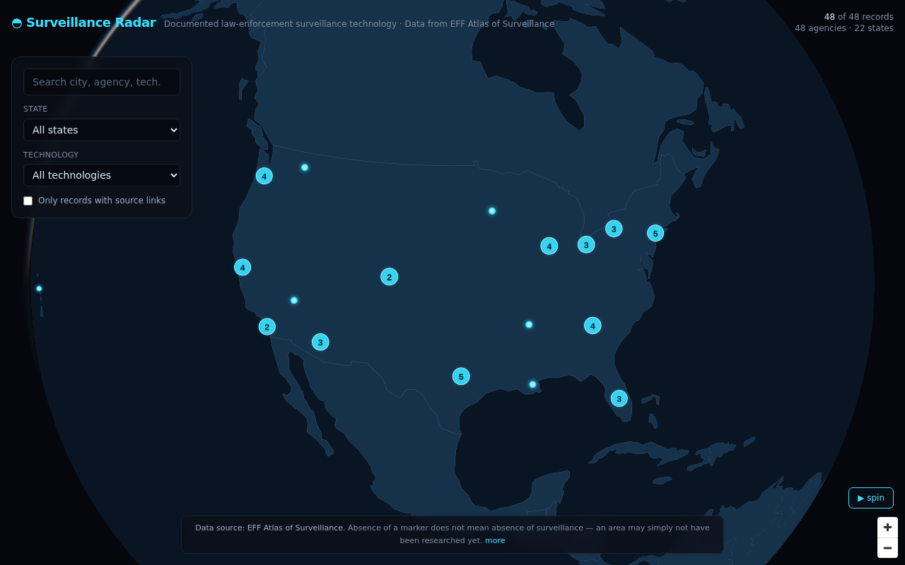

# Surveillance Radar

An interactive, dark **3D globe** that visualizes documented law-enforcement surveillance
technology across the United States — think *FlightRadar24 for surveillance tech*. Spin the
globe, zoom in, and click glowing points to see which agencies use which technologies, with
links back to the supporting evidence.

Data comes from the **EFF Atlas of Surveillance**. This is an independent visualization and is
not affiliated with or endorsed by EFF.



## What it does

- A rotatable 3D globe (MapLibre GL globe projection) on a dark starfield with a soft atmosphere.
- Glowing, clustered points for each surveillance record; clusters expand as you zoom in.
- Click a point to fly in and open a detail drawer: agency, location, technology, vendor,
  description, and **evidence links**.
- Search across agency / city / county / state / technology / vendor, and filter by state,
  technology, or "records with source links only."
- Records stacked on the same city centroid open as an "N records here" list.

## Data source & attribution

> Data source: Electronic Frontier Foundation, **Atlas of Surveillance** (published under CC BY).
> This project is an independent visualization and is not affiliated with or endorsed by EFF
> unless explicitly stated.

**Absence of a marker does not mean absence of surveillance.** It may only mean an area has not
been researched yet or the data has not been updated.

### All data sources

| Source | License | Coverage | Ingest | Refresh |
|--------|---------|----------|--------|---------|
| [EFF Atlas of Surveillance](https://www.atlasofsurveillance.org/data-library) | CC BY 4.0 | ~15k U.S. law-enforcement surveillance deployments | `pnpm ingest:atlas` | Live download every run (falls back to committed CSV, then bundled demo CSV) |
| [EFF "Data Driven" ALPR report](https://www.eff.org/pages/download-alpr-dataset) (2016-2017) | CC BY | ~200 agencies' automated license-plate-reader data-sharing stats | `pnpm ingest:alpr` | Historical, fixed-year dataset — no live endpoint; regenerated from the committed CSV |
| [OpenStreetMap](https://www.openstreetmap.org/copyright) (Overpass API) | ODbL 1.0 | `man_made=surveillance` nodes across 24 curated world cities/regions | `pnpm ingest:osm` | Live Overpass query every run (falls back to committed sample) |
| [Wikidata](https://www.wikidata.org/wiki/Wikidata:Licensing) (SPARQL / WDQS) | CC0 1.0 | Intelligence agencies (`wd:Q47913`) + law-enforcement agencies (`wd:Q732717`), worldwide, with coordinates | `pnpm ingest:wikidata` | Live SPARQL query every run (falls back to committed sample) |
| [U.S. Census Gazetteer](https://www.census.gov/geographies/reference-files/time-series/geo/gazetteer-files.2025.html) (2025) | Public domain (U.S. government work) | City/county centroids used for offline Atlas geocoding | `pnpm ingest:centroids` | Regenerated from committed Census files (no live endpoint; annual Census release) |

```bash
pnpm ingest:all   # runs every ingest above, in dependency order
```

`.github/workflows/refresh-data.yml` runs `pnpm run ingest:all` weekly (Wednesdays 05:23 UTC) and
on demand, and commits any changed files under `data/` and `public/`.

**Non-destructive by design:** every network-backed ingest script builds its result fully in
memory first and only overwrites the committed file on success. A source that's unreachable, rate
limited, or exceeds its time budget simply keeps the file already on disk — a failed or partial CI
run never leaves a half-written or empty dataset. Each script uses a per-request timeout, retries
once before giving up, and enforces a total wall-clock budget for the whole source.

The OSM and Wikidata layers are optional, **toggleable** (off by default), and let you
cross-reference EFF deployments against other public datasets. Each is baked to a static file in
`public/` at ingest time — no runtime API dependency — exactly like the Atlas. Both ship with a
small, clearly-labeled **sample file** (verified against Wikidata's own data — see note below) so
they render offline before the first successful live ingest. They're styled distinctly from the
cyan EFF points and toggled from the "Cross-reference layers" panel (top-right).

> A previous version of this repo's Wikidata query used QID `Q1414557` for "law enforcement
> agency" — that QID is actually **"nondisjunction"** (a genetics term) and silently returned zero
> results. It's been corrected to `Q732717`. Verified 2026-08-03 against
> `https://www.wikidata.org/wiki/Special:EntityData/Q732717.json`.

The static files are loaded through the same `NEXT_PUBLIC_BASE_PATH` mechanism as
`public/world.geojson`, so the layers work when served from a subpath (e.g. GitHub Pages).

> These layers are independent open datasets, not part of — nor endorsed by — the EFF Atlas.

## How to use the real Atlas dataset

`pnpm ingest:atlas` tries a **live download** from the EFF Atlas of Surveillance first
(`https://www.atlasofsurveillance.org/download.csv`, with a fallback mirror), so a normal run
already refreshes the real dataset — this is what the weekly GitHub Actions workflow relies on.
The data-library page itself warns that automated downloads are "often blocked with HTTP 403";
that wasn't reproduced when probed on 2026-08-03 (verified `HTTP 200`, `text/csv`, ~8.4MB, headers
matching the committed snapshot byte-for-byte), but if your network blocks it, the ingest falls
back automatically, in order:

1. Live download (writes `data/raw/atlas-of-surveillance.csv` on success).
2. The committed `data/raw/atlas-of-surveillance.csv` snapshot, if present.
3. The bundled demo dataset (`data/raw/sample-atlas.csv`).

To force a manual import instead:

1. Download the complete CSV from the EFF Atlas of Surveillance Data Library:
   https://atlasofsurveillance.org/pages/data-library
2. Save it to `data/raw/atlas-of-surveillance.csv`.
3. Run the ingest:
   ```bash
   pnpm ingest:atlas
   ```

The ingest script is **header-tolerant** (it maps common column-name variants), validates records
with Zod, geocodes them, and writes `data/processed/atlas-records.json` + `atlas-summary.json` +
`public/atlas-records.json` (the copy the running app actually fetches).

### Geocoding

The Atlas CSV is mostly city/county/state without coordinates. Rather than call a rate-limited
geocoding API, the ingest resolves coordinates **offline** from a bundled centroid table
(`data/centroids/us-places.json`), in order: `city + state` → `county + state` → `state` centroid.
This is deterministic, keyless, and works during static builds. Each record records which method
was used (`geocodeSource`); centroid-approximated records are noted in the UI. Extend the centroid
table to improve coverage of smaller places.

## Run locally

```bash
pnpm install
pnpm ingest:all     # refreshes every source (falls back to committed/bundled data if offline)
pnpm dev            # http://localhost:3000
```

## Build

```bash
pnpm build
pnpm start
```

## Deployment (Vercel-ready)

Standard Next.js app. Deploy directly to Vercel. The processed JSON is committed, so the build
needs no raw CSV. Land outlines render from a bundled GeoJSON (`public/world.geojson`) and labels
fall back to local glyph rendering — **no API keys required**.

If you prefer not to redistribute the processed data, delete the committed
`data/processed/*.json`, run `pnpm ingest:atlas` as part of your deploy pipeline, and keep the raw
CSV out of source control.

## Limitations

- Coverage reflects what the EFF Atlas has documented; it is not a complete record of all
  surveillance technology in use.
- Points geocoded to a city/county/state centroid are approximate locations, not precise sites.
- The bundled demo data uses real public agency/technology/vendor categories but **placeholder
  source URLs** (`example.org/...`). Replace it with the real Atlas CSV for genuine evidence links.

## Safety & ethics

This project uses **public data only** and is built to inform, not to target. It does not — and
must not be extended to — track individuals, identify officers, evade law enforcement, or target
private people. Source and evidence links are always preserved. Language is kept neutral and
source-backed.

## Project structure

```
surveillance-radar/
  app/                     # Next.js App Router (page, layout, styles)
  components/
    MapExperience.tsx      # state + composition
    map/Globe.tsx          # MapLibre globe, spin, clustering, glow, click→drawer
    map/Controls.tsx       # search + filters
    map/LayerToggles.tsx   # toggle the OSM / Wikidata cross-reference layers
    map/RecordDrawer.tsx   # detail panel
    layout/Footer.tsx      # disclaimer + attribution
  lib/atlas/               # schema (Zod), normalize, geocode, search, filters, theme
  scripts/ingest-atlas.ts       # EFF CSV (live download w/ fallback) -> normalized, geocoded, validated JSON
  scripts/ingest-eff-alpr.ts    # EFF "Data Driven" ALPR CSV -> data/processed + public/eff-data-driven-alpr.json
  scripts/ingest-osm.ts         # Overpass (24 curated world regions) -> public/osm-surveillance.geojson
  scripts/ingest-wikidata.ts    # SPARQL (intelligence + law-enforcement agencies) -> public/wikidata-agencies.geojson
  scripts/ingest-census-centroids.ts  # Census Gazetteer -> data/centroids/us-places.json
  .github/workflows/refresh-data.yml  # weekly + on-demand `pnpm run ingest:all`, commits changed data
  data/
    raw/                   # drop the real atlas-of-surveillance.csv here
    centroids/             # bundled offline centroid table
    processed/             # generated app data (committed)
  public/world.geojson              # bundled land outlines (no tile server needed)
  public/atlas-records.json         # EFF Atlas records the app fetches (CC BY)
  public/eff-data-driven-alpr.json  # EFF ALPR data-sharing records (CC BY)
  public/osm-surveillance.geojson   # OSM surveillance nodes (sample committed; ODbL)
  public/wikidata-agencies.geojson  # Wikidata agencies (sample committed; CC0)
```

## Extracting into its own repository

This app is fully self-contained inside the `surveillance-radar/` folder. To split it out:

```bash
# from the surveillance-radar/ directory
git init
git add .
git commit -m "Surveillance Radar"
# then add your new remote and push
```

(Or use `git subtree split --prefix surveillance-radar -b surveillance-radar-only` from the parent
repo to preserve history.)
